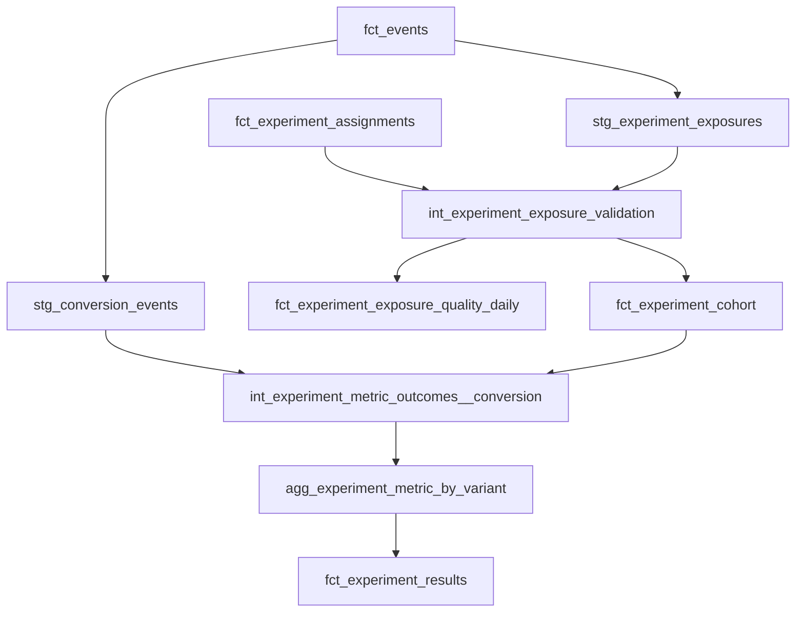

## Experimentation Analytics Platform

Spark-based analytics pipeline for experimentation data with an explicit
assignment -> exposure -> outcomes model. The goal is to make experiments
auditable, guardrail-ready, and analysis-safe by default.

## Architecture Overview



| Model | Grain | Purpose |
| --- | --- | --- |
| `stg_experiment_exposures` | event_id | Standardized exposure events. |
| `int_experiment_exposure_validation` | experiment_id x unit_id | Exposure integrity flags and timestamps. |
| `fct_experiment_exposure_quality_daily` | experiment_id x date_day | Daily exposure health metrics. |
| `fct_experiment_cohort` | experiment_id x unit_id | Canonical cohort with ITT/exposure flags. |
| `int_experiment_metric_outcomes__conversion` | experiment_id x unit_id | Binary conversion outcome within window. |
| `agg_experiment_metric_by_variant` | experiment_id x metric_id x variation_id | Aggregated counts and rates per variant. |
| `fct_experiment_results` | experiment_id x metric_id x variation_id | Uplift, p-value, and confidence interval. |

### Example Output
Sample `fct_experiment_results` row:

| experiment_id | metric_id | variation_id | n_users | conversion_rate | uplift_abs | p_value_two_sided | ci_low | ci_high |
| --- | --- | --- | ---: | ---: | ---: | ---: | ---: | ---: |
| exp_1 | conversion_7d | treatment | 10020 | 0.034 | 0.004 | 0.041 | 0.000 | 0.008 |

- **uplift_abs**: absolute difference in conversion rate vs control.
- **p_value_two_sided**: probability of observing this uplift if true uplift is 0.
- **CI (ci_low/ci_high)**: 95% interval for the absolute uplift estimate.

### Core data products
- `data/silver/fact_assignment_canonical`: canonical assignments (J1)
- `data/silver/int_experiment_exposure_validation`: assignment-to-exposure validation (J2)
- `data/gold/fct_experiment_quality_metrics_daily`: daily exposure quality metrics (J2)

### Key analysis modes
- **ITT (intent-to-treat)**: analyze all assigned users, regardless of exposure
- **Exposure-based**: analyze only users with a valid exposure

The platform is designed to support both, and requires analysts to choose
the appropriate mode explicitly.

### Jobs
Generate synthetic data:
`python jobs/00_generate_data.py --dt 2026-02-01`

Build canonical assignments (J1):
`python jobs/10_build_assignments.py --dt 2026-02-01`

Build exposure validation + quality metrics (J2):
`python jobs/20_build_exposure_validation.py --dt 2026-02-01`

### dbt quality tests (portfolio)
A minimal dbt project is included to demonstrate data tests on the
Spark-produced tables. See `dbt/models/experiments/sources.yml`.

## Demo This Repo

### dbt commands
Run the full project:
`dbt deps && dbt run`

Run only experiment models:
`dbt run --select models/experiments/*`

### Core tables to open
- `int_experiment_exposure_validation`
- `fct_experiment_exposure_quality_daily`
- `fct_experiment_cohort`

### Example A/B Test Output (J6)
Sample `fct_experiment_results` rows:

| experiment_id | metric_id      | variation_id | n_users | conversion_rate | uplift_abs | p_value_two_sided | ci_low  | ci_high |
| --- | --- | --- | ---: | ---: | ---: | ---: | ---: | ---: |
| exp_1 | conversion_7d | control   | 10000 | 0.030 | 0.000 | 1.000 | 0.000 | 0.000 |
| exp_1 | conversion_7d | treatment | 10020 | 0.034 | 0.004 | 0.041 | 0.000 | 0.008 |

- **uplift_abs**: absolute difference in conversion rate vs control.
- **p_value_two_sided**: probability of observing this uplift if true uplift is 0.
- **CI (ci_low/ci_high)**: 95% interval for the absolute uplift estimate.

### Local smoke queries (DuckDB)
If you don't have a DWH, use DuckDB to query Parquet outputs locally:
`python3 -m pip install duckdb`

Open a DuckDB shell and create views:
```
create view fct_experiment_assignments as
select * from read_parquet('data/silver/fact_assignment_canonical/dt=2026-02-01/*.parquet');

create view int_experiment_exposure_validation as
select * from read_parquet('data/silver/int_experiment_exposure_validation/dt=2026-02-01/*.parquet');

create view fct_experiment_exposure_quality_daily as
select * from read_parquet('data/gold/fct_experiment_quality_metrics_daily/dt=2026-02-01/*.parquet');
```

Then run the queries in `docs/j2_smoke_queries.sql` (adjust date syntax if needed).

### Failure modes + detection
- **Broken exposure logging** → exposure_rate drops in quality daily.
- **Pre-assignment exposure** → `pre_assignment_exposure` spikes in validation.
- **Variant mismatch** → `variant_mismatch` spikes in validation.
- **Multi-variation exposure** → `multi_variation_exposure` spikes.
- **Late exposure** → `exposure_outside_window` increases.

### Next steps (J4–J8)
- J4: metric spine (eligibility + attribution windows)
- J5: metric definitions layer (metrics contract)
- J6: experiment results engine (uplift + stats)
- J7: statistical validation (SRM, power, sanity checks)
- J8: guardrail monitoring (safety + automatic gating)
