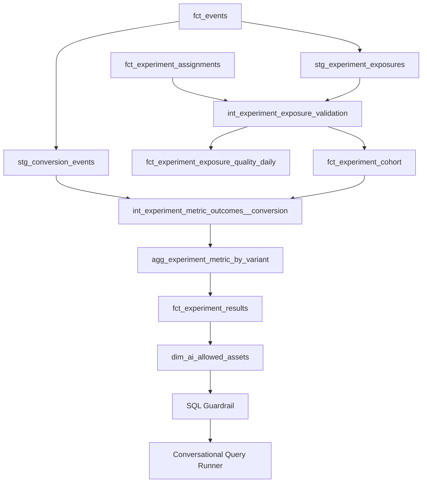

## Experimentation Analytics Platform

Experimentation analytics pipeline with an explicit  
assignment → exposure → outcomes model.

The goal is to make experiments:

- auditable  
- guardrail-ready  
- statistically sound  
- analysis-safe by default  
- AI-queryable with governance  

The platform is designed for production (Spark → Silver → Gold)  
and includes a fully portable DuckDB execution mode for local reproducibility.

---

## Architecture Overview



---

## Core Models

| Model | Grain | Purpose |
| --- | --- | --- |
| `stg_experiment_exposures` | event_id | Standardized exposure events. |
| `int_experiment_exposure_validation` | experiment_id × unit_id | Exposure integrity flags and timestamps. |
| `fct_experiment_exposure_quality_daily` | experiment_id × date_day | Daily exposure health metrics. |
| `fct_experiment_cohort` | experiment_id × unit_id | Canonical cohort with ITT/exposure flags. |
| `int_experiment_metric_outcomes__conversion` | experiment_id × unit_id | Binary conversion outcome within window. |
| `agg_experiment_metric_by_variant` | experiment_id × metric_id × variation_id | Aggregated counts and rates per variant. |
| `fct_experiment_results` | experiment_id × metric_id × variation_id | Uplift, p-value, and confidence interval. |
| `dim_ai_allowed_assets` | asset_name | Semantic contract for AI-queryable tables. |

---

## Example Output (J6)

Sample `fct_experiment_results` row:

| experiment_id | metric_id | variation_id | n_users | conversion_rate | uplift_abs | p_value_two_sided | ci_low | ci_high |
| --- | --- | --- | ---: | ---: | ---: | ---: | ---: | ---: |
| exp_1 | conversion_7d | treatment | 10020 | 0.034 | 0.004 | 0.041 | 0.000 | 0.008 |

- **uplift_abs**: absolute difference in conversion rate vs control.
- **p_value_two_sided**: probability of observing this uplift if true uplift is 0.
- **CI (ci_low/ci_high)**: 95% interval for the absolute uplift estimate.

---

## Core Data Products

- `silver.fact_assignment_canonical` → canonical assignments (J1)
- `silver.int_experiment_exposure_validation` → assignment-to-exposure validation (J2)
- `gold.fct_experiment_quality_metrics_daily` → daily exposure health metrics (J2)
- `gold.fct_experiment_results` → statistical experiment output (J6)

---

## Key Analysis Modes

- **ITT (intent-to-treat)**  
  Analyze all assigned users, regardless of exposure.

- **Exposure-based analysis**  
  Analyze only users with valid exposure.

The platform supports both and requires explicit analyst selection.

---

## Jobs (Production Mode)

Generate synthetic data:
`python jobs/00_generate_data.py --dt 2026-02-01`

Build canonical assignments (J1):
`python jobs/10_build_assignments.py --dt 2026-02-01`

Build exposure validation + quality metrics (J2):
`python jobs/20_build_exposure_validation.py --dt 2026-02-01`

---

## dbt Quality Tests

A minimal dbt project demonstrates source contracts and integrity checks.

Run:

`dbt deps && dbt build`

Source contracts include:

- uniqueness constraints
- not_null checks
- accepted_values validation
- exposure timing validation

---

## Local Portable Mode (DuckDB)

The repository includes a DuckDB-based runtime that simulates Silver/Gold
tables using seeded synthetic data.

This allows the full experimentation logic to run locally without Spark
or a cloud warehouse.

### Seeded Demo Scenario

The local DuckDB mode includes a minimal synthetic experiment:

- Experiment: `exp_demo_001`
- 3 assigned users
- 2 valid exposures
- 1 missing exposure
- Daily quality metrics computed from validation

#### Example: `int_experiment_exposure_validation`

| experiment_id | user_id | assigned_variant_id | first_exposure_at | validation_status |
| --- | --- | --- | --- | --- |
| exp_demo_001 | u1 | control | 2026-02-01 10:02 | valid |
| exp_demo_001 | u2 | treatment | 2026-02-01 10:01 | valid |
| exp_demo_001 | u3 | control | null | no_exposure |

This produces:

- exposure_rate = 0.6667  
- valid_exposure_rate = 0.6667  
- mismatch_rate = 0.0000  

The dataset is intentionally small to make integrity behavior transparent.


### Quick start

```bash
make setup
make deps
make seed
make build
make demo_ai
```

---

## AI Semantic Layer & Guardrails

The platform includes a governance-first AI integration layer.

### Semantic Contract

`dim_ai_allowed_assets` defines:

- which assets AI may query
- their grain
- primary keys
- business descriptions

This acts as a controlled semantic layer.

### SQL Guardrail

`scripts/ai_sql_guard.py`:

- extracts referenced tables
- validates against allowlist
- blocks non-approved queries

### Conversational Demo

`scripts/ai_query_runner.py` demonstrates:

1. Natural language question
2. LLM-style query plan (stubbed)
3. SQL validation
4. Execution if approved

Unsafe queries are explicitly blocked.

---

## Failure Modes + Detection

- **Broken exposure logging** → exposure_rate drops in daily quality metrics.
- **Pre-assignment exposure** → spike in `pre_assignment_exposure`.
- **Variant mismatch** → spike in `variant_mismatch`.
- **Multi-variation exposure** → spike in `multi_variation_exposure`.
- **Late exposure** → increase in `exposure_outside_window`.

Quality monitoring is first-class in the architecture.

---

## Next Steps (J4–J8)

- J4: metric spine (eligibility + attribution windows)
- J5: metric definitions layer (metrics contract)
- J6: experiment results engine (uplift + stats)
- J7: statistical validation (SRM, power, sanity checks)
- J8: guardrail monitoring (safety + automatic gating)
